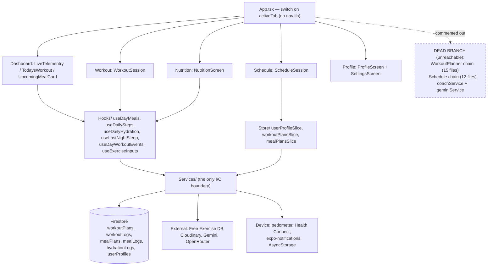

# PulseFit — Design-vs-Reality Gap Report

Audit date: 2026-09-19 · Branch `main` @ `fffaf95` · Auditor: architecture gap analysis (read-only)

---

## 1. Summary

### Stack (verified from `package.json`, `README.md:33-58`)

| Concern | Actual |
|---|---|
| Framework | Expo SDK 57, React Native 0.86, React 19.2, TypeScript 6 |
| Navigation | **None** — `App.tsx:176-226` is a `switch` over `activeTab` state |
| Auth | Firebase Auth email/password (JS SDK, `@firebase/auth`) |
| Database | Cloud Firestore, 6 top-level collections |
| State | Redux Toolkit, 3 slices (`userProfileSlice`, `workoutPlansSlice`, `mealPlansSlice`) |
| Storage | Cloudinary (unsigned) for avatars — **no Firebase Storage**, no `storage.rules` |
| Functions | **None** — no `functions/` directory, no callables |
| AI | Gemini + OpenRouter over plain `fetch` |
| Device | `expo-sensors` pedometer + `react-native-health-connect` (steps, sleep) |

### Firebase services actually in use

- **Firestore** — `workoutPlans`, `workoutLogs`, `mealPlans`, `mealLogs`, `hydrationLogs`, `userProfiles`
- **Auth** — email/password + password reset
- **Not used**: Storage, Cloud Functions, Realtime Database, FCM (local notifications only), App Check, Analytics
- **No emulator config** in `firebase.json` (it contains only `firestore.rules` + `firestore.indexes.json` wiring)

### Counts by status

| Status | Count | Feature IDs |
|---|---|---|
| Implemented | 9 | F-001, F-002, F-003, F-004, F-005, F-006, F-007, F-008, F-009 |
| Partial | 4 | F-010, F-011, F-012, F-013 |
| UI-only | 5 | F-014, F-015, F-016, F-017, F-018 |
| Stubbed | 2 | F-019, F-020 |
| Dead | 3 | F-021, F-022, F-023 |
| Not started | 2 | F-024, F-025 |

### Top risks

1. **P0 — The Nutrition tab's headline card is entirely fake.** `calorieTotal = 2200`, `calorieConsumed = 1310`, `calorieBurned = 650` are literals (`src/Screens/Nutrition/NutritionScreen.tsx:185-187`) and `MACROS` is a literal array (`:39-43`). Every ingredient to compute them for real already exists and is already in Firestore — `sumItemNutrition()` (`src/Services/mealPlanService.ts:132`), completed `mealLogs` written by `useDayMeals` (`src/Hooks/useDayMeals.ts:196-217`), and `DerivedTargets` on the profile (`src/Services/userProfileService.ts:62-72`). This is pure wiring, and it is the app's core nutrition promise.
2. **P0 — The Dashboard's second half is prop defaults.** `bodyWeightKg = 68.4`, `weeklyAvgKcal = 485`, `monthlyGoalPercent = 89`, `calorieBudgetTotal = 2100`, `calorieBudgetConsumed = 1420`, `DEFAULT_MACROS`, `WEEK_ACTIVITY` (`src/Screens/Dashboard/LiveTelementry.tsx:42-66, 107-113`). Only steps, calories-burned-from-steps, hydration and sleep are real. No caller ever passes these props (`App.tsx:182`), so the defaults are what users always see.
3. **P1 — 29 modules are unreachable from `App.tsx`,** including the entire `WorkoutPlanner` plan-builder chain and the Firestore-backed `Schedule` chain, plus `coachService` + `geminiService` (the AI coach). Roughly a third of `src/Screens` is compiled-but-unrunnable design. `README.md:716+` documents two of these swaps but the list is larger, and the README's claim that `ScheduleSession`/`WorkoutSession` are "presentational replacements" with an unwired data layer is **stale** — both are now genuinely Firestore-backed.

### Verification level reached

**L1 (static) only.** The Firebase CLI is not installed on this machine (`firebase: command not found`), no Firebase MCP server is available, and no emulator is configured in `firebase.json`. A `.env` exists but was deliberately not read. **Every "data exists" claim below is UNVERIFIED**; what *is* verified is the reader/writer code-path analysis, which is sufficient to prove NO-WRITER cases. See §8.

---

## 2. Architecture snapshot



Layering convention (`README.md:696-712`, holds everywhere I checked): screens never import `firebase/firestore`; they go through `src/Services/*`. Every service exposes its own `*ServiceError`. Dates crossing the Firestore boundary are `"YYYY-MM-DD"` device-local strings; times are `"8:30 AM"`.

---

## 3. Feature inventory

| ID | Feature | Design evidence | Status | Data status | Prio |
|---|---|---|---|---|---|
| F-001 | Email auth + password reset | `src/Screens/Auth/EmailAuthScreen.tsx`, `ForgotPasswordScreen.tsx`, `Services/emailAuthService.ts` | Implemented | n/a (Auth) | — |
| F-002 | 4-step onboarding → `userProfiles/{uid}` | `Screens/Onboarding/*`, `userProfileService.ts:286` | Implemented | UNVERIFIED (writer proven) | — |
| F-003 | Workout plan CRUD + live sync | `workoutPlanService.ts:88-179`, `Store/workoutPlansSlice.ts`, `NewPlanModal.tsx` | Implemented | UNVERIFIED (writer proven) | — |
| F-004 | Workout session logging (sets/reps/weight) | `WorkoutSession.tsx:464-486`, `workoutLogService.ts:161` | Implemented | UNVERIFIED (writer proven) | — |
| F-005 | Meal plan CRUD + live sync | `mealPlanService.ts:239-323`, `NewMealPlanModal.tsx` | Implemented | UNVERIFIED (writer proven) | — |
| F-006 | Meal logging (planned/completed) | `useDayMeals.ts:196-258`, `mealLogService.ts:101` | Implemented | UNVERIFIED (writer proven) | — |
| F-007 | Hydration tracking | `hydrationLogService.ts:122`, `NutritionScreen.tsx:227-263`, `HydrationCard.tsx` | Implemented | UNVERIFIED (writer proven) | — |
| F-008 | Step counting (HC + pedometer) | `stepService.ts`, `healthConnectSteps.ts`, `README.md:616-654` | Implemented | Device-local, no Firestore | — |
| F-009 | Sleep card (Health Connect) | `useLastNightSleep.ts`, `healthConnectSleep.ts`, `LiveTelementry.tsx:157-171` | Implemented | Device-local | — |
| F-010 | Dashboard overview metrics | `LiveTelementry.tsx:33-66` | **Partial** | NO-WRITER (weight, burn-per-workout) | **P0** |
| F-011 | Nutrition calorie/macro card | `NutritionScreen.tsx:39-43, 185-187`, `CalorieMacroCard.tsx` | **Partial** | PRESENT-but-unread (mealLogs) | **P0** |
| F-012 | Exercise catalogue / library / detail | `exerciseService.ts`, `ExerciseLibrary.tsx`, `ExerciseDetail.tsx:353-366` | Partial | External API, UNVERIFIED | P2 |
| F-013 | Workout reminders / notifications | `reminderService.ts`, `Store/useReminderSync.ts`, `App.tsx:160`, `Task.daily.txt:1,11` | Partial | Device-local | P1 |
| F-014 | Settings screen preferences | `SettingsScreen.tsx:69-170, 186-190` | **UI-only** | NO-WRITER | P1 |
| F-015 | Weekly activity bar chart | `LiveTelementry.tsx:58-66, 457-473` | **UI-only** | NO-WRITER | P1 |
| F-016 | Body weight metric + delta | `LiveTelementry.tsx:42-43, 318` | **UI-only** | NO-WRITER | P1 |
| F-017 | Monthly activity goal gauge | `LiveTelementry.tsx:45, 182, 532-537` | **UI-only** | NO-WRITER | P1 |
| F-018 | Schedule calorie estimate per session | `Schedule.tsx:182` (dead) | UI-only | NO-WRITER | P3 |
| F-019 | Exercise "Common mistakes" tab | `ExerciseDetail.tsx:353-358` | Stubbed | External API lacks field | P3 |
| F-020 | Exercise "Joint safety" tab | `ExerciseDetail.tsx:360-366` | Stubbed | External API lacks field | P3 |
| F-021 | AI coach insight (Gemini) | `coachService.ts` (whole file), `AICoachBanner.tsx` | **Dead** | Unreachable | P2 |
| F-022 | Plan builder (`WorkoutPlanner`) | `App.tsx:38-42`, `WorkoutPlanner.tsx` + 14 files | **Dead** | Unreachable | P2 |
| F-023 | Firestore Schedule screen (`Schedule.tsx`) | `App.tsx:32-36`, `Schedule.tsx` + 11 files | **Dead** | Unreachable | P2 |
| F-024 | Prescribed sets/reps per plan exercise | `WorkoutSession.tsx:62-67`, `workoutPlanService.ts:23-31` | Not started | Field absent from model | P1 |
| F-025 | AI workout/meal plan templates | `src/Task.daily.txt:4` | Not started | — | P3 |

---

## 4. Firebase data audit

All rows are **evidence level L1 (static)** — see §8. "Rules" is the verdict of reading `firestore.rules` against the exact query the code issues.

| Path | Readers | Writers | Rules | Index | Data status |
|---|---|---|---|---|---|
| `userProfiles/{uid}` | `userProfileService.ts:249` (`getDoc`); `Store/userProfileSlice.ts` | `userProfileService.ts:286` (`setDoc`), `:332`, `:355` (theme/avatar merges) | OK — `firestore.rules` matches on doc id == uid; `resource == null` read allowed | none needed (doc get) | UNVERIFIED |
| `workoutPlans/{autoId}` | `workoutPlanService.ts:120` (`onSnapshot`), `:146` (`getDocs`) | `:88` (`addDoc`), `:169` (`updateDoc`), `:179` (`deleteDoc`) | OK — `where('userId','==',uid)` pairs with `ownsExisting()`; see risk in §6.1 | Single equality only → auto index. `:115` comment claims "needs composite (userId, createdAt DESC)" but the query has **no `orderBy`** — sorting is client-side at `:126`. Comment is stale. | UNVERIFIED |
| `workoutLogs/{uid}_{planId}_{date}` | `workoutLogService.ts:252` (date query), `:273` (`getDoc`), `:299` (all-for-user) | `:161` (`setDoc`), `:202` (planned occurrence) | OK — create pins doc id to uid; `allow delete: if false` | `where userId == && where date ==` → two equalities, served by merged single-field indexes. `firestore.indexes.json` is empty `{"indexes":[],"fieldOverrides":[]}` — **acceptable today**, but any future `orderBy` breaks it | UNVERIFIED |
| `mealPlans/{autoId}` | `mealPlanService.ts:270` (`onSnapshot`), `:292` | `:241` (`addDoc`), `:313`, `:323` | OK | none needed | UNVERIFIED |
| `mealLogs/{uid}_{planId}_{date}` | `mealLogService.ts:121`, `:143` | `useDayMeals.ts:196, 217, 237` → `mealLogService.ts:105` | OK — id pinned; `allow delete: if false` | two equalities, OK | UNVERIFIED |
| `hydrationLogs/{uid}_{date}` | `hydrationLogService.ts:102` | `:129` (`setDoc`) | OK — deliberately does not pin doc id (`firestore.rules`, documented) | none needed | UNVERIFIED |
| *`stepLogs`* | — | — | no rule | — | **Does not exist.** Steps are device-local by design (`README.md:397-400`). This is the root cause of F-015/F-017 |
| *`bodyWeightLogs`* | — | — | no rule | — | **Does not exist.** Root cause of F-016 |
| *user settings/preferences* | — | — | no rule | — | **Does not exist** (only `themeMode` on the profile). Root cause of F-014 |
| Firebase Storage | — | `avatarService.ts` uses **Cloudinary**, not Storage | no `storage.rules` file | — | n/a — intentional |
| Cloud Functions | — | — | — | — | **None exist.** No callable is referenced anywhere in `src/` |

### NO-WRITER findings (the important ones)

| # | What reads it | What would have to write it | Consequence |
|---|---|---|---|
| NW-1 | `LiveTelementry.tsx:318` body weight | nothing — weight is captured once in onboarding (`BodyMetricsStep.tsx`) and never re-logged | The weight metric can never move. Showing a delta (`bodyWeightDeltaKg`) is meaningless without a history collection. |
| NW-2 | `LiveTelementry.tsx:473` `WEEK_ACTIVITY` | nothing — no per-day historical step or burn record is ever persisted; `stepService` keeps only a today-ledger in AsyncStorage | The week chart is permanently fictional. Fixing it requires a new daily-rollup write path, not a UI change. |
| NW-3 | `LiveTelementry.tsx:532` `monthlyGoalPercent` | nothing — same root cause as NW-2 plus no stored goal | Gauge is permanently fictional. |
| NW-4 | `SettingsScreen.tsx:186` `toggles` state | nothing — `flip()` (`:189`) only calls `setToggles`; no service, no write | Every toggle except Dark mode resets on unmount. The screen is honest about this (`:241-246`) but the controls still imply persistence. |
| NW-5 | `NutritionScreen.tsx:285-288` calorie card | `mealLogs` **is** written, it is simply never read into this card | Not a true NO-WRITER — a pure wiring gap. Cheapest high-value fix in the repo. |

---

## 5. Per-feature detail

### F-010 / F-011 — Dashboard + Nutrition headline numbers are fake  [P0]

**Design evidence**
- `src/Screens/Dashboard/LiveTelementry.tsx:42-50` — props `bodyWeightKg`, `weeklyAvgKcal`, `monthlyGoalPercent`, `calorieBudgetTotal`, `calorieBudgetConsumed`, `macros` are all declared optional.
- `:52-66` — `DEFAULT_MACROS` and `WEEK_ACTIVITY` literals.
- `:107-113` — the defaults: `bodyWeightKg = 68.4`, `weeklyAvgKcal = 485`, `monthlyGoalPercent = 89`, `calorieBudgetTotal = 2100`, `calorieBudgetConsumed = 1420`, `macros = DEFAULT_MACROS`.
- `App.tsx:182` — the only call site passes **only** `onProfilePress`, so every default is what ships.
- `src/Screens/Nutrition/NutritionScreen.tsx:39-43` — `MACROS` literal; `:185-187` — `calorieTotal = 2200`, `calorieConsumed = 1310`, `calorieBurned = 650`; `:281-287` — passed straight into `CalorieMacroCard`.
- `README.md` "Known gaps" already admits the Dashboard half of this.

**Traced chain (calorie/macro card)**

| Hop | Where | Real? |
|---|---|---|
| UI | `NutritionScreen.tsx:281-287` → `CalorieMacroCard.tsx` | yes |
| values | `NutritionScreen.tsx:185-187` literals | **NO** |
| hook | `useDayMeals(selectedDate)` is already mounted at `:86-98` and returns `dayCards` | yes, unused for totals |
| service | `mealLogService.fetchMealLogsForDate` (`:139`) + `mealPlanService.sumItemNutrition` (`:132`) | yes, exists |
| targets | `userProfileService.DerivedTargets` (`:62-72`) — `calorieTarget`, `proteinG`, `carbsG`, `fatsG`, already in the Redux store via `selectUserProfile` | yes, exists |
| Firestore | `mealLogs` where `userId ==` and `date ==`; `userProfiles/{uid}` | reachable, rules OK |

**What is missing:** one selector/aggregation between `useDayMeals` and the card. Nothing in Firestore, rules or indexes needs to change.

**Tech path** — see `backlog.md` **T-001** (nutrition totals) and **T-002** (dashboard budget). Burn side: `calorieBurned` should come from `stepData.caloriesBurned`, which `LiveTelementry.tsx:149` already computes — lift that derivation into a shared hook rather than duplicating it.

---

### F-014 — Settings preferences are a non-persisting preview  [P1]

**Design evidence:** `SettingsScreen.tsx:69-170` declares 7 toggle rows across "Notifications & alerts", "Training", "Data & privacy"; `:170-178` `DEFAULT_TOGGLES`; `:312` footer "PulseFit • Preferences coming soon".
**Traced chain:** `Switch` (`:275`) → `flip()` (`:189`) → `useState` only. No service import, no write. Dark mode is the sole exception and is real: `applyTheme` (`:203`) → `saveUserThemeMode` → `userProfiles/{uid}` merge (`userProfileService.ts:332`).
**Also dead:** the `kind: 'value'` rows render a `ChevronRight`/`Download` affordance but the row `View` (`:262`) has **no `onPress` at all** — "Export health & workout data", "Privacy policy", "Terms of service", "Units of measure", "Week starts on", "Smart scale" are non-interactive chevrons.
**What is missing:** a `preferences` map on `userProfiles/{uid}` plus a service function following the `saveUserThemeMode` pattern exactly. Rules already permit it (`userProfiles` allows any write where `profileId == uid` and `userId` field is preserved).
**Note:** `workoutReminders` / `mealReminders` are not cosmetic — `useReminderSync` (`App.tsx:160`) is live, so the toggle currently lies about a feature that *is* running.

---

### F-013 — Reminders: the README is wrong, and there is a known double-fire bug  [P1]

`README.md` "Known gaps" states reminders are commented out. **They are not.** `App.tsx:61-62` imports `useReminderSync` and `expo-notifications` (uncommented), `:66-73` installs the notification handler, and `:160` calls `useReminderSync(hasSession)`. Only the surrounding *comment block* explaining the disablement survives — a stale comment sitting directly above live code, which is a trap for the next reader.
`src/Task.daily.txt:11` records "notification bug - throwing 2 notification message" and `:1` "push notifications" as open.
**What is missing:** (a) correct the stale comment/README, (b) fix the duplicate-notification bug, (c) gate scheduling on the (currently non-persisted) `workoutReminders` preference → depends on F-014.

---

### F-021 / F-022 / F-023 — Dead code: 29 unreachable modules  [P2]

Computed by a module-graph walk from `App.tsx` following relative imports, ignoring commented-out import lines:

- **Schedule chain (12):** `Schedule.tsx`, `ScheduleData.ts`, `AICoachBanner.tsx`, `AppHeader.tsx`, `DateNavigator.tsx`, `ScheduleTitleBar.tsx`, `TimelineCard.tsx`, `TimelineRow.tsx`, `UpcomingCard.tsx`, `UpcomingSection.tsx`, `ViewToggle.tsx`, `WeekStrip.tsx`
- **Workout planner chain (15):** `WorkoutPlanner.tsx`, `PlanBuilder.tsx`, `SavedPlansList.tsx`, `ActivePlanCard.tsx`, `AIOptimizationBanner.tsx`, `DaySelector.tsx`, `EditExerciseModal.tsx`, `EditPlanModal.tsx`, `ExerciseList.tsx`, `Header.tsx`, `RoutineProfileSummary.tsx`, `SaveControls.tsx`, `SaveSuccessModal.tsx`, `ScheduleTimeSelector.tsx`, `SessionReminder.tsx`, `StepIndicator.tsx`
- **AI coach (2):** `Services/coachService.ts`, `Services/geminiService.ts` — `coachService` is not imported by *any* file, and it is the only consumer of `geminiService`. So the app's entire Gemini integration is unreachable; only OpenRouter (via `nutritionAiService`) actually runs.
- **Also:** `Theme/typography.ts` (unreferenced)

**Mock data lives only in this dead branch** — which is good news: `ScheduleData.ts:6-38` (`weekDays`, `upcomingItems` with "Downtown Locker #42") is consumed only by `Schedule.tsx:22,53,260`, and `Data.ts` `INITIAL_PLANS`/`INITIAL_EXERCISES` (Bench Press, Push Pull Legs) only by `WorkoutPlanner.tsx:64-83`. Critically, `WorkoutPlanner.tsx:69` does `[...mapped, ...INITIAL_PLANS]` — **it concatenates fake plans onto the user's real Firestore plans**. If `WorkoutPlanner` is ever re-enabled as-is, users see four invented plans mixed into their own data. That line must be deleted before any revival.

Note that `Data.ts` is *not* wholly dead: `DAY_ORDER`, `todayDayKey`, `DURATION_OPTIONS`, `EXERCISE_CATEGORY_FILTERS`, `REMINDER_OFFSET_OPTIONS` are live constants used by reachable modules.

**Decision required from a human** (see §7): revive, or delete.

---

### F-024 — Plans carry no prescribed sets/reps  [P1]

`WorkoutPlanService.WorkoutPlanInput` (`workoutPlanService.ts:23-31`) is `{ name, muscles, exerciseIds, days, time, status }` — there is no per-exercise prescription. `WorkoutSession.tsx:62-67` documents this: *"Plans only ever stored `exerciseIds`, never sets/reps/weight per exercise… there is no real set-tracking data model yet."*

Worth correcting: that comment then says the numbers shown are "invented placeholders". As of the current code they are **not** — `useExerciseInputs.ts:9` starts every set at `{ reps: '', weight: '' }` and `WorkoutSession.tsx:421-422` renders saved values or empty strings. So the app is honest; the comment is stale. The real gap is the *absence of a target* to log against (no "3 × 8-10 @ 60kg" to aim at), which is what a plan builder would produce.

---

### F-012 / F-019 / F-020 — Exercise detail tabs  [P3]

`ExerciseDetail.tsx:353-358` and `:360-366` render `EmptyTab` with "Common mistakes coming soon" / "Joint safety notes coming soon". These are honest stubs, correctly explaining the external Free Exercise DB has no such field. Not a defect — but they are shipped tab affordances leading to nothing, and should either be sourced (an AI generation via the already-present OpenRouter service is the natural fit, cached to Firestore) or hidden.

---

### F-015 / F-016 / F-017 — Dashboard charts with no data model behind them  [P1]

These three are grouped because they share one root cause: **there is no historical time-series collection of any kind.** `README.md:397-400` states steps are deliberately device-local with no `stepLogs` collection, and `stepService.ts` keeps only a today-ledger in AsyncStorage. Consequently the week bar chart, the monthly gauge, and the body-weight delta cannot be made real by UI work — each needs a new write path first. This is why the backlog orders `T-005` (daily rollup collection) before `T-006`/`T-007`.

---

## 6. Cross-cutting issues

### 6.1 Rules — the `in`-disjunction list-query risk is real and self-documented

`firestore.rules` `ownsExisting()` allows a document with **no `userId` field at all** to be read, to keep pre-scoping documents readable. The file itself flags the risk: for a *list* query Firestore evaluates the query's constraints rather than reading documents, and whether the disjunction pairs with `where('userId','==',uid)` is not something the docs commit to. **Verdict:** this is correctly identified and correctly mitigated (every service applies the `where`, and `workoutPlanService.ts:126` additionally re-filters client-side). I would go further and schedule a one-off backfill so the branch can be dropped entirely — see `T-009`.

### 6.2 Indexes — `firestore.indexes.json` is empty, and that is currently fine

Every query in the repo is either a doc `get` or equality-only (`where userId ==` optionally plus `where date ==`), which Firestore serves from automatic single-field indexes. **No `INDEX-MISSING` finding.** Two hazards: (a) the stale comment at `workoutPlanService.ts:115` claims a composite index on `(userId, createdAt DESC)` is needed when the query has no `orderBy` — this will mislead someone into deploying an unnecessary index or, worse, into adding the `orderBy` believing it is covered; (b) any future `orderBy`/range filter will fail at runtime with no index file to fall back on.

### 6.3 Sorting and filtering are done client-side

`fetchWorkoutPlans` (`:126`) pulls all of a user's plans and sorts in JS; `fetchWorkoutLogsForUser` (`:299`) pulls the user's **entire** log history with no limit, on every mount of `WorkoutProgressCard` (`:57`). Fine at tens of documents, a real cost and latency problem at thousands. Flagged as P3 hardening (`T-010`).

### 6.4 Config / environment

`.env.example` declares 14 `EXPO_PUBLIC_*` vars. Several features degrade silently rather than loudly if unset: `exerciseService.ts:7` (`BASE_URL`) gates the entire exercise catalogue — without it, exercise names in `WorkoutSession`/`ScheduleSession` fall back to `humanizeExerciseId()` (`WorkoutSession.tsx:69`), which renders raw database ids with underscores replaced. `nutritionAiService.ts:136` logs and skips when OpenRouter is unconfigured. No startup check surfaces a misconfigured build to the developer or user.

### 6.5 Stale documentation (a correctness risk in its own right)

Three documented facts are now false, and all three are the kind that cause a reader to make a wrong change:

| Claim | Where | Reality |
|---|---|---|
| "Reminders are commented out in `App.tsx`" | `README.md` Known gaps; `App.tsx:51-60` comment block | Live at `App.tsx:160` |
| "`ScheduleSession` / `WorkoutSession` are presentational replacements, data layer not wired" | `README.md` Known gaps; `App.tsx:32-42` | Both are fully Firestore-backed (`ScheduleSession.tsx:124-235`, `WorkoutSession.tsx:464`) |
| "Needs a composite index on (userId ASC, createdAt DESC)" | `workoutPlanService.ts:115` | Query has no `orderBy` |
| "those numbers below are still invented placeholders" | `WorkoutSession.tsx:64` | Inputs start empty (`useExerciseInputs.ts:9`) |

Given this repo's stated convention that *"source comments are the real documentation"* (`README.md:709`), stale comments are a first-class defect here. `T-011`.

### 6.6 Unused dependencies

`nativewind` + `tailwindcss` (with `global.css`, `tailwind.config.js`, and babel/metro wiring) and `react-native-gifted-charts` are installed and shipped in the bundle but used nowhere — `README.md` confirms styling is hand-rolled `themedStyles` and charts are hand-drawn SVG. Dead bundle weight.

---

## 7. Open questions for a human

1. **Dead branch: revive or delete?** 29 files. If the plan builder (`WorkoutPlanner`) is being reintroduced "elsewhere" as `App.tsx:41` suggests, where? If not, deleting the two chains removes ~4,500 lines and the mock-data-merge landmine at `WorkoutPlanner.tsx:69`. This decision gates T-012/T-013 and should be made first.
2. **Is the AI coach (Gemini) wanted?** `coachService.ts` is complete and well-designed but has no caller, and it is the only user of `geminiService`. Either wire it into the Dashboard (a banner slot already exists in the dead `AICoachBanner.tsx`) or delete both and drop the Gemini env vars.
3. **Historical metrics: how much history does the product actually want?** A `dailyMetrics/{uid}_{date}` rollup unlocks F-015/F-016/F-017 at once, but it is a new collection, new rules, a new write path, and a backfill question (there is no past data to backfill from — the charts will be empty for the first week). Acceptable?
4. **Body weight re-logging.** Onboarding captures weight once. Should the Profile screen gain a "log weight" action, or should a smart-scale/Health Connect integration own it? The Settings screen already advertises "Smart scale — Not connected" (`SettingsScreen.tsx:100-104`).
5. **Settings scope.** Seven toggles are advertised. Which are real commitments versus design filler? Persisting all seven is cheap; *honouring* `biometricLock`, `voiceCoach`, `haptics` and `weeklyDigest` is four separate features.
6. **Should `Data & privacy → Export` ship?** It is the only row with a distinct icon affordance, implying it was intended as real.

---

## 8. Verification limits

**Evidence level reached: L1 (static analysis) for all Firebase claims. No L2 check was possible.**

What I could not do, and why:

| Not verified | Why |
|---|---|
| Whether any document exists in any collection | Firebase CLI not installed (`firebase: command not found`); no Firebase MCP server available; `firebase.json` declares no emulator suite, so nothing local to read |
| Actual field shapes of stored documents vs. TypeScript types | Same. Every service normalizes missing fields with fallbacks (`workoutLogService.ts:71-85`, `workoutPlanService.ts:50-57`), which makes SCHEMA-MISMATCH invisible from the client — a legacy shape degrades silently to zeros rather than erroring |
| Deployed rules vs. checked-in `firestore.rules` | No CLI access. The repo copy may not be what is live in project `fitness-tracker-4690b` |
| Deployed indexes vs. the empty `firestore.indexes.json` | Same. Indexes created by hand in the console would not appear in this file |
| Whether the `ownsExisting()` `in`-disjunction actually passes list queries in production | Requires a live read; this is the file's own flagged known risk |
| Runtime behaviour of device features (steps, sleep, notifications) | Requires an Android dev build; none of it works in Expo Go per `README.md:682-694` |
| `.env` contents | Deliberately not read — secrets policy. Only `.env.example` was consulted |

**To raise these to L2, a human can run** (read-only, from the repo root, with `firebase login` already done):

```bash
npm i -g firebase-tools
firebase use fitness-tracker-4690b
# Deployed-vs-local drift:
firebase firestore:indexes            # compare against firestore.indexes.json (expected: empty)
# Document counts / samples — Firebase console is easiest:
#   console.firebase.google.com/project/fitness-tracker-4690b/firestore/data
#   check: workoutPlans, workoutLogs, mealPlans, mealLogs, hydrationLogs, userProfiles
# Rules drift:
#   console.firebase.google.com/project/fitness-tracker-4690b/firestore/rules
#   diff the published version against ./firestore.rules
```

The findings that do **not** depend on live access — the NO-WRITER set (NW-1 … NW-4), the hardcoded literals, and the 29 unreachable modules — are proven from source and are where the backlog concentrates.
